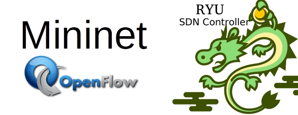

# Topology-Discover
Project of Virtualized and Softwarize Mobile Network

## Requirements
### Mininet
to install mininet, you can simply follow the link
(http://mininet.org/download/)

### Ryu Controller
to install ryu controller, you can simply follow the link
(https://ryu.readthedocs.io/en/latest/getting_started.html)

  

 

### Java IDE
we personally used Intellij as IDE

  

 

## Project Layout 
    Granelli_Software
    ├── immagini host e switch                   # Images used inside java code   
    ├── musiche e gif                            # Sounds and gifs used inside java code
    ├── programma                                # Java code for topology display 
    ├── python per creazione txt                 # python code to launch ryu controller 
    ├── python per creazione topologia           # python code to create the topology
    ├── topologia1_remove.txt                    # txt generaed after removing the first topology
    ├── topologia1_preremove.txt                 # txt generaed after creating the first topology
    ├── topologia2_remove.txt                    # txt generaed after removing the second topology
    ├── topologia2_preremove.txt                 # txt generaed after creating the second topology
    ├── topologia3_remove.txt                    # txt generaed after removing the third topology
    ├── topologia3_preremove.txt                 # txt generaed after creating the third topology
    ├── Power.pptx                               # power point 
    └── README.md 

## Running the Code
To run the code, you have to open two different terminals. On the first one you should launch the ryu contorller (the code in )

## Presentation
[PRESENTATION] (https://onedrive.live.com/edit.aspx?resid=71C1E9E7ACF08D9B!7424&cid=71c1e9e7acf08d9b&CT=1676738984741&OR=ItemsView)

#Team Members

COMPONENTS:
- SARA FERRARI
- HAFSA HAMZAOUI
